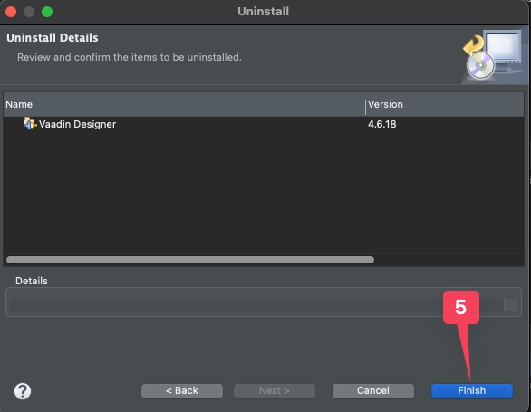

# Installing arbitrary Vaadin Designer versions in Eclipse

Your first option should always be to install the latest version, available at the [official update site](https://vaadin.com/eclipse). There might be special situations where you require to install (or rollback to) a previous version. That is the sole repository of this guide.

## Uninstall
Before installing a previous version, it's always recommended to delete/uninstall the previous one to avoid conflicts. Please follow these steps to ensure correct removal of the plugin:

 - Using Eclipse's ***Help*** menu, click on the ***Install New Software*** option.  
 - On the _Install_ dialog that opens, click on the ***What is already installed?*** option.  
 - On the _Installation Details_ dialog (_Installed Software_ tab), select Vaadin Designer and click on the ***Uninstall*** button below.  
 - Finally, click on the ***Finish*** button on the _Uninstall_ confirmation dialog. Restart your IDE if prompted.  

## Installation
Before performing a manual installation of Vaadin Designer, make sure you have uninstalled previous versions by following the [Uninstall](#uninstall) section above. Then follow these steps:

 - Download your desired version from the [previous-releases](./previous-releases/) directory.
 - Using Eclipse's ***Help*** menu, click on the ***Install New Software*** option.  
 - On the _Install_ dialog that opens, click on the ***Add*** button, then on the ***Archive*** button inside the _Add Repository_ dialog. Lastly, point the file browser to your previously downloaded file and click on ***Open***.  
 - Now, click on the ***Add*** button inside the _Add Repository_ dialog (adding a name is optional)  
 - Eclipse will analyze the file and populate the _Available Sotware_ list. Select Vaadin Designer and click on the ***Next*** button on the lower section of the dialog.  
 - Review the _Install Details_ dialog and click on the ***Finish*** button.  
 - If you get a _Trust_ popup during installation, due to expired certificates, mark them all as trusted by clicking on ***Select All*** button and then click on the ***Trust Selected*** button on the lower section of the dialog.  
 - Last, make sure to restart your IDE when prompted so the plugin is loaded.

## Help/Additional information
If you are experiencing an issue, feel free to [Report it](https://github.com/vaadin/designer/issues/new) and fill in the relevant information. Especially the **Steps to reproduce** is important, since it helps us pinpoint and test the issue. If you find issues that are important to you, please vote for them by reacting with :+1:.

For more information about the product itself, please visit the product homepage https://vaadin.com/designer or our [documentation](https://vaadin.com/docs/latest/tools/designer).
